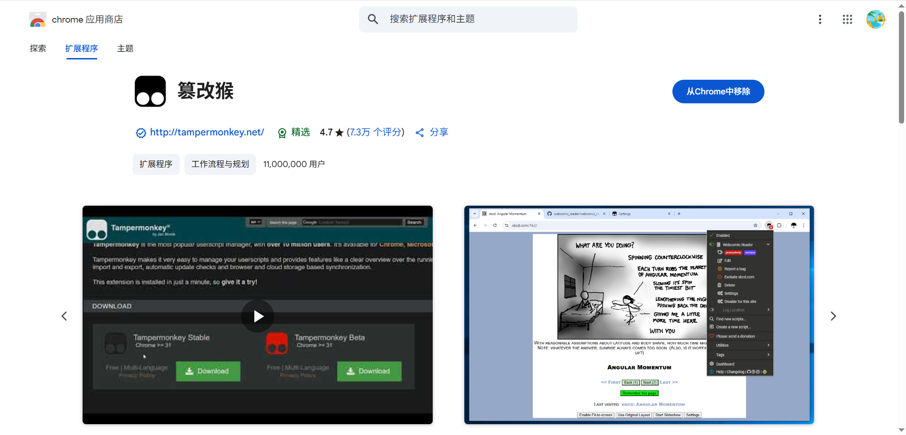
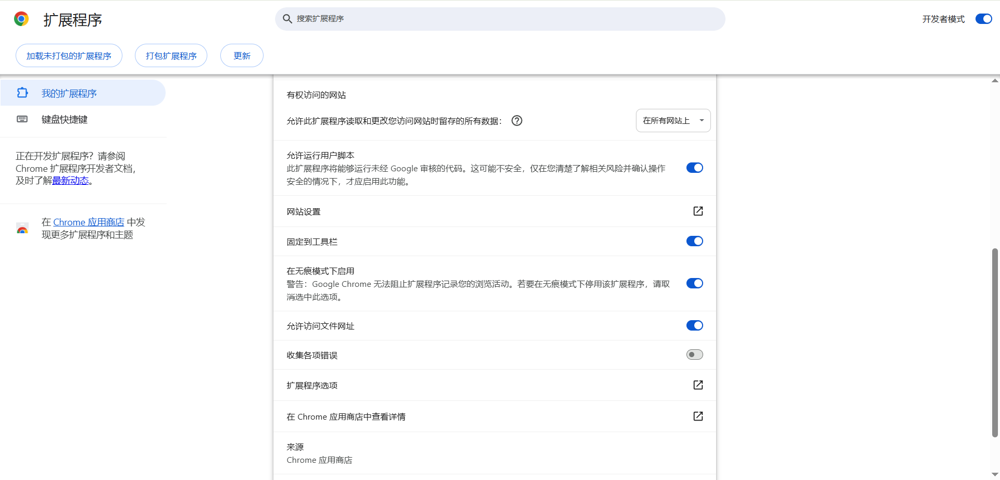
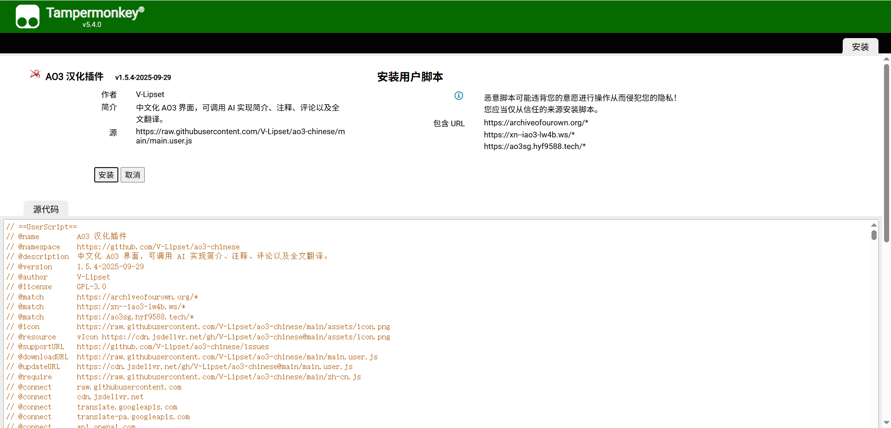
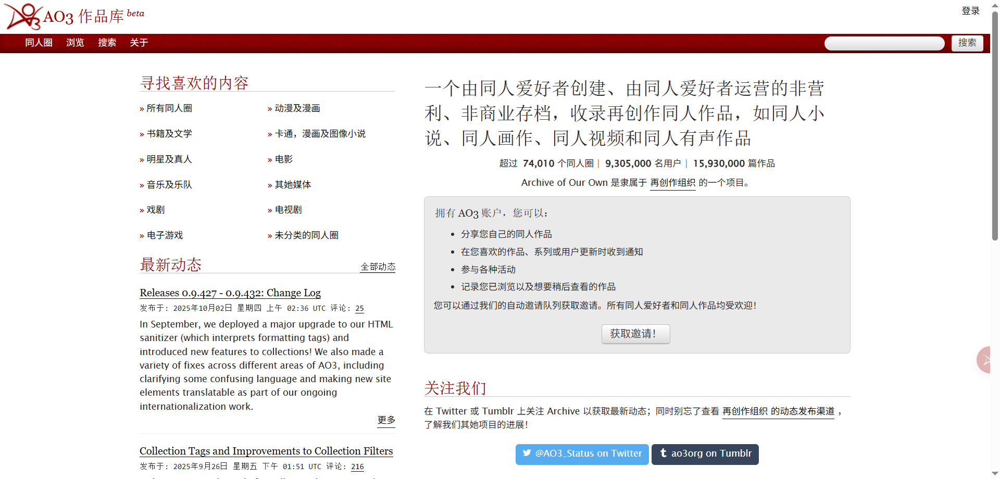




在浏览器中安装一个用户脚本管理器，推荐使用 [Tampermonkey](https://www.tampermonkey.net/) 。




开启浏览器 `管理扩展程序` 页面中的 `开发者模式` 。




点击 `篡改猴` -> `详情` -> `允许运行用户脚本` 。




选择一个版本进行安装：

- 主用
  - [远程版](https://raw.githubusercontent.com/V-Lipset/ao3-chinese/main/main.user.js)
  - [本地版](https://raw.githubusercontent.com/V-Lipset/ao3-chinese/main/local.user.js)
- 备用
  - [远程版](https://cdn.jsdelivr.net/gh/V-Lipset/ao3-chinese@main/main.user.js)
  - [本地版](https://cdn.jsdelivr.net/gh/V-Lipset/ao3-chinese@main/local.user.js)




安装好插件后，请刷新 [AO3](https://archiveofourown.org/) 页面。




